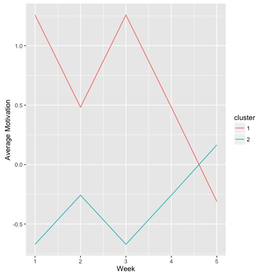
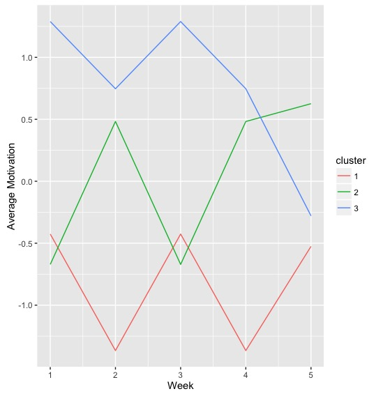
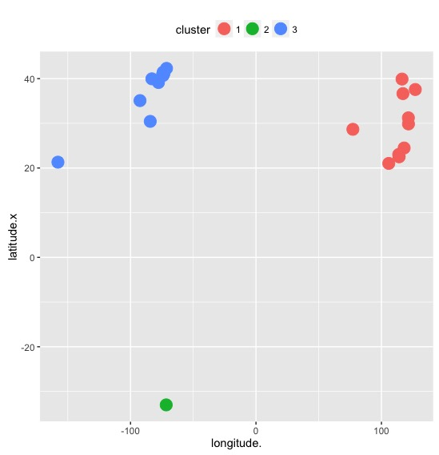
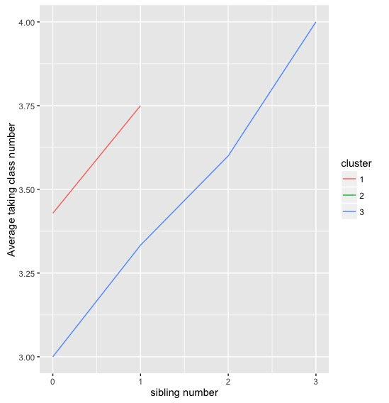
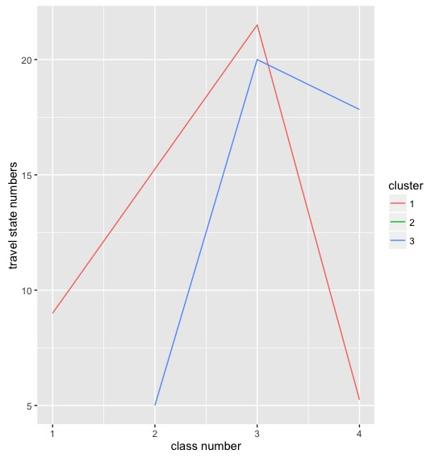
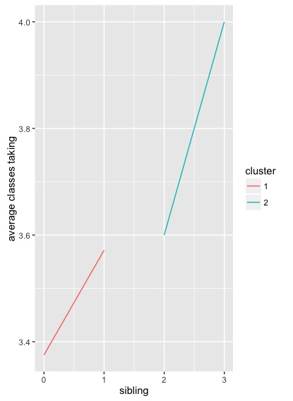

In this assignment we will be applying the K-means clustering algorithm we looked at in class. At the following link you can find a description of K-means, create a webpage index in Zotero and add some notes about the use and limitations of K-means clustering:

https://www.cs.uic.edu/~wilkinson/Applets/cluster.html

You will need three packages to complete this assignment: "dplyr", "tidyr" and a new package called "ggplot2". Install ggplot2 and then load all three packages.

```{r}

install.packages("ggplot2") #If this doesn't work, use the "Packages" tab to install the package.

library(dplyr)
library(tidyr)
library(ggplot2)

```

Now, upload the file "Class_Motivation.csv" from the Assignment 3 Repository as a data frame called "K1""
```{r}

K1 <- read.table(...)

```

This file contains the self-reported motivation scores for a class over five weeks. We are going to look for patterns in motivation over this time and sort people into clusters based on those patterns.

But before we do that, we will need to manipulate the data frame into a structure that can be analyzed by our clustering algorithm.

The algorithm will treat each row as a value belonging to a person, so we need to remove the id variable.

```{r}

K2 <- dplyr::select(K1, 2:6)

```

It is important to think about the meaning of missing values when clustering. We could treat them as having meaning or we could remove those people who have them. Neither option is ideal. What problems do you foresee if we recode or remove these values? Write your answers below:


We will remove people with missing values for this assignment, but keep in mind the issues that you have identified.


```{r}

K3 <- na.omit(K2) #This command create a data frame with only those people with no missing values. It "omits" all rows with missing values, also known as a "listwise deletion". EG - It runs down the list deleting rows as it goes.

```

Another pre-processing step used in K-means is to standardize the values so that they have the same range. We do this because we want to treat each week as equally important - if we do not standardise then the week with the largest range will have the greatest impact on which clusters are formed. We standardise the values by using the "scales()" command.

```{r}

K3 <- scale(K3)

```


Now we will run the K-means clustering algorithm we talked about in class. 
1) The algorithm starts by randomly choosing some starting values 
2) Associates all observations near to those values with them
3) Calculates the mean of those clusters of values
4) Selects the observation closest to the mean of the cluster
5) Re-associates all observations closest to this observation
6) Continues this process until the clusters are no longer changing

Notice that in this case we have 5 variables and in class we only had 2. It is impossible to vizualise this process with 5 variables.

Also, we need to choose the number of clusters we think are in the data. We will start with 2.

```{r}

fit <- kmeans(K3, 2) 

#We have created an object called "fit" that contains all the details of our clustering including which observations belong to each cluster.

#We can access the list of clusters by typing "fit$cluster", the top row corresponds to the original order the rows were in. Notice we have deleted some rows.

fit$cluster

#We can also attach these clusters to te original dataframe by using the "data.frame" command to create a new data frame called K4.

K4 <- data.frame(K3, fit$cluster)

#Have a look at the K4 dataframe. Lets change the names of the variables to make it more convenient with the names() command.

names(K4) <- c("1", "2", "3", "4", "5", "cluster") #c() stands for concatonate and it creates a vector of anything, in this case a vector of names.


```

Now we need to visualize the clusters we have created. To do so we want to play with the structure of our data. What would be most useful would be if we could visualize average motivation by cluster, by week. To do this we will need to convert our data from wide to long format. Remember your old friends tidyr and dplyr!

First lets use tidyr to convert from wide to long format.
```{r}

K5 <- tidyr::gather(K4, "week", "motivation", 1:5)

```

Now lets use dplyr to average our motivation values by week and by cluster.

```{r}

K6 <- K5 %>% group_by(week, cluster)
K6 <- summarise(K6, avg = mean(motivation))

```

Now it's time to do some visualization! We are going to start using the ggplot2 package, a very popular visualization package in R. It is based on the "Grammar of Graphics" a theory of how visualizations work best. If you are interested, you can read more about it here: 

https://www.cs.uic.edu/~wilkinson/TheGrammarOfGraphics/GOG.html

And you can see the range of available graphics in ggplot here:

http://docs.ggplot2.org/current/

We are going to create a line plot similar to the one created in the school dropout paper we looked at in class (Bowers, 2010). It will have motivation on the Y-axis and weeks on the X-axis. To do this we will want our weeks variables to be treated as a number, but because it was created from a variable name it is currently being treated as a character variable. You can see this if you click on the arrow on the left of K6 in the Data pane. Week is designated by "chr". To convert it to numeric, we use the as.numeric command. 

Likewise, since "cluster" is not numeric but rather a categorical label we want to convert it from an "integer" format to a "factor" format so that ggplot does not treat it as a number. We can do this with the as.factor() command.

```{r}

K6$week <- as.numeric(K6$week)

K6$cluster <- as.factor(K6$cluster)

```

Now we can plot our line plot using the ggplot command, "ggplot()".

- The first argument in a ggplot is the dataframe we are using: K6
- Next is what is called an aesthetic (aes), the aesthetic tells ggplot which variables to use and how to use them. Here we are using the variables "week" and "avg" on the x and y axes and we are going color these variables using the "cluster" variable
- Then we are going to tell ggplot which type of plot we want to use by specifiying a "geom()", in this case a line plot: geom_line()
- Finally we are going to clean up our axes labels: xlab("Week") & ylab("Average Motivation")

```{r}

ggplot(K6, aes(week, avg, colour = cluster)) + geom_line() + xlab("Week") + ylab("Average Motivation")

```

What patterns do you see in the plot?

It would be useful to determine how many people are in each cluster. We can do this easily with dplyr.

```{r}
K7 <- dplyr::count(K4, cluster)
```

Look at the number of people in each cluster, now repeat this process for 3 rather than 2 clusters. Which cluster grouping do you think is more informative? Write your answer below:

#I think the 2-cluster graph have more information than the 3-cluster one, because we can see the trend of 2 clusters representing 2 types of student with opposite motivations toward class activities. I guess cluster2 students like the assignments in week2 and week5 while the other cluster of students dont like the assignments. 
#The 3-cluster graph does not show a clear behavior pattern. Bigger sample size is needed.


image: 

image: 


Once you have done this, save both of your plots to the Assignment 5 file. Create a Zotero item to index your new computer program (Assignment 5.rmd) in Zotero. Then commit your assignment, push it to your Github account and then Pull request your version to the original assignment version so I can see it.

##Extension Exercise

Now, try to do the same for the data [collected in class](https://tccolumbia.qualtrics.com/SE/?SID=SV_6RRqlSAM6lZWYQt). Create two groups of clusters, the answers to the questions and regions where people grew up. Then create a visualization that shows the overlap between the two groups of clusters.

Code Book:

Duration (in seconds)
Q1 - First Name
Q2 - Last Name
Q3 - Have you ever owned a cat?
Q4 - Do you pronounce "gif", with a J (j-iff) or a G (g-iff)?
Q5 - How many months have you lived in New York City?
Q6 - How many siblings (brothers/sisters) do you have?
Q7 - How many times do you play sport each week?
#Q8 - How many miles do you travel from home to TC?
Q9 - Estimate how many of your friends own Android phones
Q10 - How many movies have you seen in the cinema this year?
#Q11 - How many classes are you taking this semester?
Q12 - How many states have you visited in the US?
#Q13 - What city/town did you grow up in?
Q14 - What state/province did you grow up in?
Q15 - What country did you grow up in?

```{r}

#Assignment3
#manually input latitude and longitude, manually change title of column
T1 <- read.table("cluster-class-data.csv", sep = ",", header = TRUE)
T2 <- dplyr::select(T1, latitude,longitude.)
T3 <- na.omit(T2)
T3 <- scale(T3)
fit1 <- kmeans(T3, 3) 
fit1$cluster
T4 <- data.frame(T3, fit1$cluster)
names(T4) <- c("latitude", "longitude","cluster") 
T4$cluster <- as.factor(T4$cluster)

#reconstruct T5, join cluster info into T1
T1$ID<-seq.int(nrow(T1))
T4$ID<-seq.int(nrow(T4))
T5 <- dplyr::full_join(T1, T4,by="ID")

ggplot(T5, aes(longitude., latitude.x, colour = cluster)) + geom_line() + xlab("longitude") + ylab("latitude")
p <- ggplot(T5,aes(longitude., latitude.x))
p + geom_point(size=5,aes(colour=cluster))+theme(legend.position='top')
#two major groups in class: North America and Asia. 1 student from South America.


```
image: 
```{r}


#lets look at whether sibling and class number are related
T6 <- T5 %>% group_by(sibling, cluster)
T6 <- summarise(T6, avg = mean(classes))
T6$cluster <- as.factor(T6$cluster)
ggplot(T6, aes(sibling, avg, colour = cluster)) + geom_line() + xlab("sibling number") + ylab("Average taking class number")
#it seems both cluster patterns (1 and 3) are similar: the students with more sibling tends to take more classes 
#(possible hypothesis: The kids grow up in bigger family tend to handle stress better? and this is cross cultural.)
```
image: 
```{r}
#lets look at whether home from TC distance and class number are related
T7 <- T5 %>% group_by(classes, cluster)
T7 <- summarise(T7, avg = mean(travelStates))
T7$cluster <- as.factor(T7$cluster)
ggplot(T7, aes(classes, avg, colour = cluster)) + geom_line() + xlab("class number") + ylab("travel state numbers")
# the student who take less classes (=1&2) would travel least (most of them are not full time students, maybe they are working?)
#the student who take the most classes (=4) would travel less than those taking 3 classes (maybe full time students do not have time to travel?)
 
```

image: 

```{r}
#construct a new cluster based on sibling and classes info
T8 <- dplyr::select(T1, sibling,classes)
fit2 <- kmeans(T8, 2) 
fit2$cluster
T9 <- data.frame(T8, fit2$cluster)
names(T9) <- c("sibling", "classes", "cluster") 
T10 <- T9 %>% group_by(sibling, cluster)
T11 <- summarise(T10, avg = mean(classes))
T11$sibling <- as.numeric(T11$sibling)
T11$cluster <- as.factor(T11$cluster)
ggplot(T11, aes(sibling, avg, colour = cluster)) + geom_line() + xlab("sibling") + ylab("average classes taking")

```

image: 

```{r}
#in order to compare clusters, we have to construct distance matrix, using Ward Hierarchical Clustering method
d <- dist(T1, method = "euclidean")
fit <- hclust(d, method="ward.D") 
# comparing 2 cluster solutions
cluster.stats(d, fit1$cluster, fit2$cluster)

#reference from http://www.statmethods.net/advstats/cluster.html
#"where d is a distance matrix among objects, and fit1$cluster and fit2$cluster are integer vectors #containing classification results from two different clusterings of the same data."
```
#comparison result 
$n
[1] 22

$cluster.number
[1] 3

$cluster.size
[1] 11 10  1

$min.cluster.size
[1] 1

$noisen
[1] 0

$diameter
[1] 11517.7276   676.4012         NA

$average.distance
[1] 2244.0555  309.3208       NaN

$median.distance
[1] 181.0370 323.2554       NA

$separation
[1] 209.3163 105.0712 105.0712

$average.toother
[1] 1378.9647 1290.7323  797.2453

$separation.matrix
         [,1]     [,2]     [,3]
[1,]   0.0000 210.7891 209.3163
[2,] 210.7891   0.0000 105.0712
[3,] 209.3163 105.0712   0.0000

$ave.between.matrix
         [,1]      [,2]      [,3]
[1,]    0.000 1386.3657 1304.9551
[2,] 1386.366    0.0000  238.7646
[3,] 1304.955  238.7646    0.0000

$average.between
[1] 1291.927

$average.within
[1] 1373.425

$n.between
[1] 131

$n.within
[1] 100

$max.diameter
[1] 11517.73

$min.separation
[1] 105.0712

$within.cluster.ss
[1] 121346968

$clus.avg.silwidths
         1          2          3 
-0.7141152 -0.2604136  0.0000000 

$avg.silwidth
[1] -0.4754274

$g2
NULL

$g3
NULL

$pearsongamma
[1] -0.01252379

$dunn
[1] 0.009122563

$dunn2
[1] 0.1063987

$entropy
[1] 0.8454652

$wb.ratio
[1] 1.063083

$ch
[1] 0.4938726

$cwidegap
[1] 11498.8403   435.5254     0.0000

$widestgap
[1] 11498.84

$sindex
[1] 105.0712

$corrected.rand
[1] 0.3670295

$vi
[1] 0.8318027
